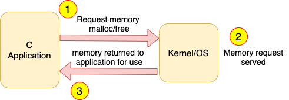

# MemoryLeakDetector

Since the advent of C/C++ programming language, memory management is one of the responsibility which developer has to deal with. C/C++ softwares often suffers from two memory related problems like Memory Corruption and Memory Leak. Unlike shitty language like Java, C/C++ do not have luxury things for automatic garbage collection. Java does not allow programmer to access the physical memory directly, but C/C++ does. Therefore, Java applications do not suffer from Memory corruption either, but C/C++ do.

According to below diagram, what happens when a C application calls malloc/free in normal world.



But, in our project how the diagram is changed:


MLD acts like a middle man between C application and OS/Kernel. All memory access via the application is passed to the OS/Kernel via MLD.

The project development phase consists of several steps:
1. MLD library will maintain the information about all structures which the application is using by creating structure database.
2. MLD library will maintain the information about all objects malloc'd by the application by creating object database.
3. MLD library triggers Memory Leak Detection Algorithm on Object database to find leaked objects.


### phase 1
Design and implementation of MLD structure database

MLD library must know the information about all structures being used by the application. It is the responsibility of the application to tell the MLD library during initialization about all structures it is using. This is called "**structure Registration**". MLD library will maintain structure database (preferably a linkedlist) to store application structure information. Key to search in structure database is "name of structure".

 

 Modeling of structure database is as below:

 ```
 typedef struct _field_info_{
   char fname[MAX_FIELD_NAME_SIZE];
   unsigned int size;
   unsigned int offset;
   data_type_t dtype;
   char nested_str_name[MAX_STRUCTURE_NAME_SIZE];
 }field_info_t;
 ```

 ```
 #define MAX_STRUCTURE_NAME_SIZE 128
 #define MAX_FIELD_NAME_SIZE 128

 typedef struct _struct_db_rec_ struct_db_rec_t;

 struct _struct_db_rec_ struct_db_rec_t{
   struct_db_rec_t *next;
   char struct_name[MAX_STRUCTURE_NAME_SIZE]; \\Key
   unsigned int ds_size;
   unsigned int n_fields;
   field_info_t *fields;
 };
```  

```
typedef enum{
  UINT8,
  UINT32,
  INT32,
  CHAR,
  OBJ_PTR,
  FLOAT,
  DOUBLE,
  OBJ_STRUCT
}data_type_t;
```
For example, our application uses below data structure:
```
typedef struct emp_{
  char emp_name[30];
  unsigned int emp_id;
  unsigned int age;
  struct emp_ *mgr;
  float salary;
}emp_t;
```
Now, our goal is that our C application should be able to register this structure with the MLD library. We are about to see how this structure information will look like in a structure database of MLD library after registration. So in structure database, the first thing to do is to create a structure database record.


As you can see, the first item is null because at this point of time there is only one structure record in the structure database. The second item is the name of the data structure. Next field is the size of the structure. After that, the next item is the number of items and last field is actually the pointer to an array which will going to store the information about each fields in the data structure. So, last item is pointer to the array of fields, and each element of the array stores the information of one field of C structure.


So, remember the data type of fields array is ```field_info_t```. And each field stores one element and its information in C structure. Note that, for "mgr" pointer, the sizeof value is specified by writing void*. No matter what data type mgr is pointing to. the size of mgr is always 4 bytes. So, you can see that how structure database will look like when the C application does registration of its structure with the MLD library. MLD library will have the information about the C structure store in the format of ```struct_db_rec_t```. Obviously, in our C application, we have to write a good deal of code in order to tell the MLD library about the information of the C structure that our C application is using. That is, first C application should malloc ```struct_db_rec_t``` and then populate the field of this structure database record with the information of C structure whose registration is being done. And then our C application should create an array of fields and finally links "fields" pointer in structure database record to point to that array.

Before proceed further, I have to mention null structure for specifying offset of a variable inside a data structure. Suppose, for example, in below data structure, we have to calculate the offset of each variable in the structure:
```
typedef struct emp_{
  char emp_name[30];
  unsigned int emp_id;
  unsigned int age;
  struct emp_ *mgr;
  float salary;
}emp_t;
```
The piece of code to specify all variables' offset is as below:
```
(unsigned int)&(((emp_t*)0)->emp_name));
(unsigned int)&(((emp_t*)0)->emp_id));
(unsigned int)&(((emp_t*)0)->age));
(unsigned int)&(((emp_t*)0)->mgr));
(unsigned int)&(((emp_t*)0)->salary));
```

### Phase 2

Phase 2 is about design and implementation of Object database. MLD library also know about all objects the application has malloc'd. So, the application must report MLD all its malloc'd objects. Whenever the application malloc a new object, MLD library will store the relevant information about this object such as corresponding structure details of the object and address of the object. Now, MLD maintains another database called Object Database and each data it holds is called object record.

```
typedef struct _object_db_rec_{
  object_db_rec_t *next;
  void *ptr; /*Key*/
  unsigned int units;
  strcut_db_rec_t *struct_rec;
}strcut_db_rec_t;
```
```
typedef struct _object_db_{
  struct_db_t *struct_db;
  object_db_rec_t *head;
  unsigned int count;
}object_db_t;
```
To use MLD, we should implement another malloc or calloc function that it is aware of MLD (called ```xcalloc```).  The synopsis of xcalloc will be like this:
```
void *
xcalloc(object_db_t* object_db, char* struct_name, int units);
```
xcalloc does the following:
1. Allocate "units" of contiguous memory for object of type "struct_name".
2. Create the object record for new allocated object, and add the object record in object database.
3. Link the object record with structure record for structure "struct_name".
4. Return the pointer to the allocated object.

Thus, xcalloc allocates memory for the object, but also create internal data structure in MLD library so that MLD can keep track of the newly allocated object. For example, let us suppose the application creates three objects:
```
student_t *ben = xcalloc(object_db, "student_t", 1);
emp_t *benyamin = xcalloc(object_db, "emp_t", 2);
student_t *beny = xcalloc(object_dbm "student_t", 1);
```
The snapshot of object_db_t is like below:


### Phase 3

The purpose of MLD library is to process object database, with the help of structure database, and find leaked application objects and report them. So, we need to implement memory leak detection algorithm in MLD library to accomplish this goal.

The entire essence of this project is as below:


Any application Data Structure eventually takes the shape of **Disjoint set of Graphs**. Leaked object are thos objects which are not reachable from any other objects. Finding a set of leaked object is a graph problem. Given a graph of nodes(objects) and edges(references from one object to another object), find all the nodes which are not reachable from any other nodes. Application objects have references to one another, overall, all application objects combined take the shape of a graph. The graph can be Disjoint, it means that application data structures can be represented as a set of isolated graphs. Each isolated individual graph has a special node called **root** of the graph. Application data structure always takes the shape of disjoint set of graphs. Below picture will illustrate leaked and reachable object:


Above sub-graphs (disjoint graph) represent application data structure relationship. Root of the graph is a node that allows us to meet the rest of the node by start traversing from it. Root objects are usually global or static objects. Every other malloc'd objects must be reachable form at least one root object. Note that, at any point of time, the overall data structure is **Directed Cyclic Graph**. At this point, the question is how MLD algorithm detects root objects? the application has to tell MLD library the set of all root objects. So, MLD library must provide an API using which an application can register its root objects. Application can create root objects in two ways:
1. Simply creating a global root object out of main function. The API which the application should register its root object is as below:
```
void mld_register_global_object_as_root(object_db_t *object_db, void *objptr,
char *struct_name, unsigned int units);
```
The objective of this function is to create a new object db record entry in object db of MLD library and mark it as root.
2. Using dynamic object creation but after that, the application should search to find the object in object_db and mark it as a root.
```
mld_set_dynamic_object_as_root(object_db_t *object_db, void *obj_ptr);
```
The MLD algorithm begins from root objects. And in most cases, global objects are also the root objects. Global objects are referenced by global variables in application, so, global objects cannot be leaked. Our MLD library assumes dynamic root objects of the application are also never leaked by the application. If dynamic root objects are leaked by the application, the MLD algorithm will not report it since it starts memory leak detection algorithm from root object assuming root objects are always reachable. And it makes sense, you want to start your journey and you need to traverse 100 stations starting from station 1 where you already present. It is not possible that you won't reach station 1 starting from station 1 (paradox!).

To explain the algorithm, consider below picture. The graph has two root object. First step in MLD algorithm is to set is_visited variable to zero.


MLD algorithm always starts with root object and no matter which one. So, the algorithm scans the object database and check which objects are root (checkpoint).


Once, the algorithm visits each node, it toggles its is_visited variable. This is also true for root objects. Then it moves from current object to its child by its ```next``` pointer.


After reaching the end of the string, the algorithm moves forward with checkpoint and try to find another root and start toggling is_visited variable for each node it sees.


At the end, when the algorithm finishes probing is_root, any object with is_visited variable remained zero is leaked object.  

Some Analysis:
1. MLD algorithm is recursive.
2. MLD algorithm is basically DFS algorithm. So basically, MLD algorithm is nothing but DFS.
3. is_visited flag is used to avoid loops.

---

### shortcomings and drawbacks

It will be easy to create a C/C++ application to fool MLD library. Basically, C is not OO based language, but Java on the other hand is. So, it would be more clean for java like languages to create a full MLD. There are some cases which are considered MLD's bugs:
1. Storing the pointer to non-pointer data types. At the end of the day, pointer are numerical numbers which represent the address in process virtual address space, and therefore can always be stored in unsigned int variable.
```
struct emp_t{
  char name[32];
  unsigned int designation;
};

struct des_t{
  char name[32];
  int job_code;
  int salary;
};
...
...
struct emp_t *emp = xcalloc(...);
struct des_t *des = xcalloc(...);

emp->designation = (unsigned int)des; // Storing the pointer to non-pointer data type.
```
The MLD library will report it as a leak which is false alarm but Java does not allow it to assign. During registration, MLD library will not find any OBJ_PTR in emp_t's data elements.
2. Indirect reference to objects. This happens when one pointer points to memory location not returned by calloc.
```
struct emp_t{
  char name[32];
  struct list_node_t *node;
};

struct des_t{
  char name[32];
  int job_code;
  emp_t *hod;
  struct list_node_t node;
};
...
...
struct emp_t *emp = xcalloc(...);
struct des_t *des = xcalloc(...);

emp->node = &des->node;
```
3. Embedded Objects.
```
struct des_t{
  char name[32];
  int job_code;
  emp_t *hod; /* this is not considered embedded as it is a reference */
  struct list_node_t node; /* this is embedded data structure and after mallocing, it will be embedded object */
};
```
4. MLD is unable to handle unions. Because unions do not have fixed size. Size of the union is the size of largest structure under union. There is no unions in Java.

All in all, if we write a C/C++ program following pure object oriented notion as in case of Java, then MLD library will be just like Java Garbage Collector. But doing so places so many constraint on programmer to use C/C++. These languages provide developer to harness the direct access to memory address, whereas java does not. So, why not make use of it?

C has not been designed to be used in object oriented way. Note that, developing a non object oriented software in object oriented way is disastrous. OOP is not always great!
